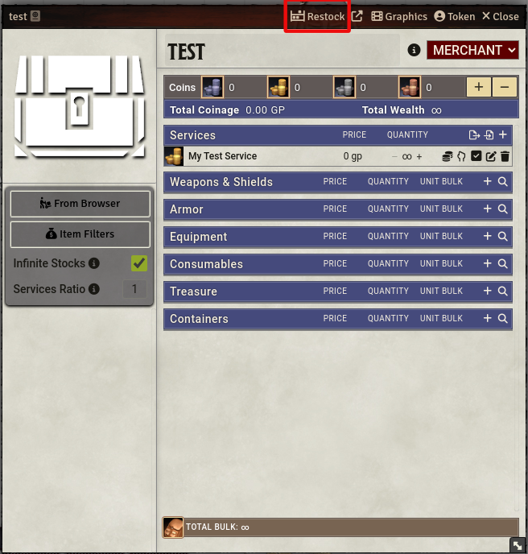
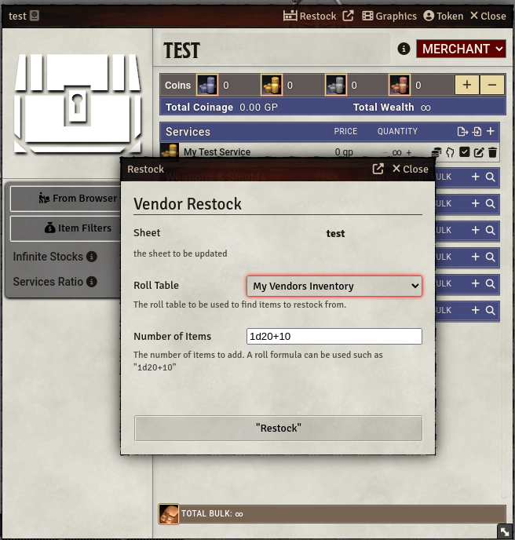

## Vendor Restock

Vendor restock adds a button to loot/merchant sheets to restock their inventories from a roll table.  The number of items to be added can be set as a roll formula such as 1d20+10.

A set of roll tables is included.  These tables contain common magic items by level

